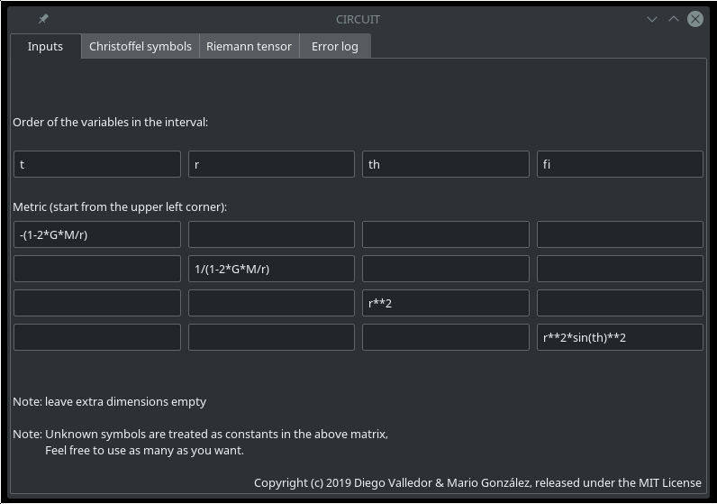
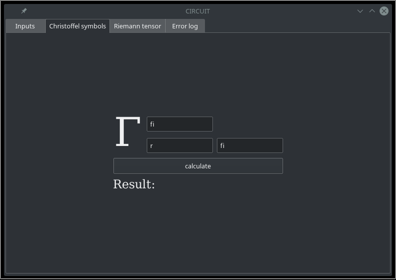
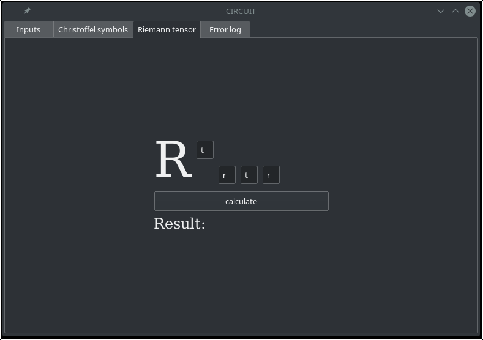
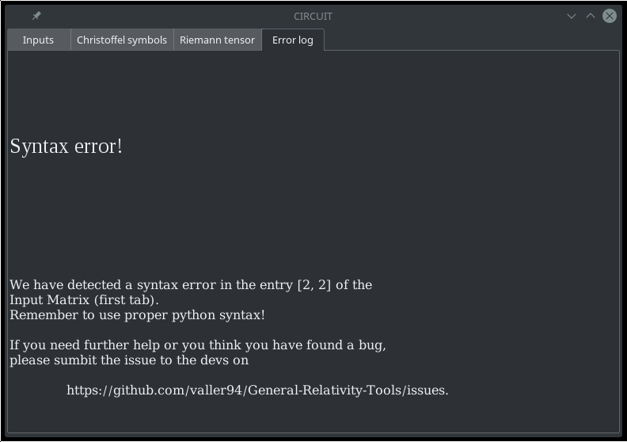
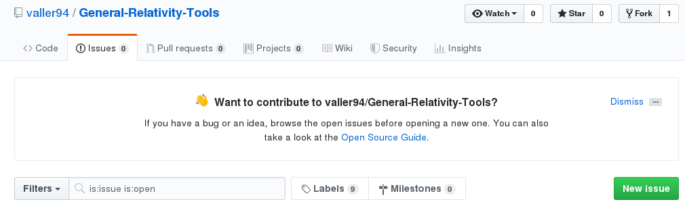

# CIRCUIT

Actualmente, CIRCUIT permite calcular de forma simbólica tanto símbolos de Christoffel como tensores de Riemman de una forma sencilla e intuitiva. Esta herramienta es especialmente útil para comprobar cálculos hechos sobre el papel, o para trabajar con métricas complicadas.

A continación se repasan las ventanas de la aplicación dando una visión general de su contenido.

## Inputs

### Orden de las variables en el intervalo:

  - Coloca aquí las variables de tu intervalo *en orden*. El orden es importante, pues los mismos símbolos se usan tanto como índices como variables respecto a las que derivar. 

  > Si tu métrica tiene tres dimensiones, deja *la última* casilla libre.

### Métrica
  
  - Escribe la métrica siguiendo las dos notas en la parte inferior, utilizando [sintaxis de Python](https://en.wikibooks.org/wiki/Python_Programming/Basic_Math).

## Christoffel symbols

  - Introduce los índices $a$, $b$ y $c$ respecto a los que quieres calcular $\Gamma^a_{bc}$ y pulsa el botón. El resultado se mostrará siguiendo las reglas sintácticas de Python.

  > Recuerda que $a$, $b$ y $c$ ya han sido definidos en la primera pestaña

  > En caso de equivocación, la apliacción te avisará y podrás leer el mensaje de error detallado en la última pestaña.

## Riemann tensor

  - Igual que en la pestaña anterior, introduce los índices correspondientes y pulsa el botón :) 

## Error log

Acude a esta pestaña cada vez la aplicación te lo pida (lo hará si encuentra algún error). Muchos mensajes de error como el de la imagen han sido ya implementados. El improbable caso de que la aplicación se cierre inesperaddamente al pulsar `calculate` en alguna de las dos anteriores pestañas, corresponderá con un error extraño que no hemos encontrado al testear la aplicación. En ese caso, agradecemos que abras un issue en esta misma página de Github (segunda pestaña debajo del título del repositorio)

Añade unas breves instrucciones para reproducir el problema (una captura de pantalla de tu primera pestaña, por ejemplo), y nos ocuparemos de resolverlo lo antes posible.

# ¿Quieres contribuir?

Si tienes una idea que para mejorar la apliación, o quieres sugerir la implementación de una nueva característica, tienes dos opciones:

  - Crea un issue con ella. Háznoslo saber. Recibirás una respuesta en poco tiempo.

  - Si te entretiene programar y aún encuentras tiempo más allá de lo que supone el último año de física, estaremos encantados de valorar tu Pull Request e introducir tu ocntribución en este repositorio.

